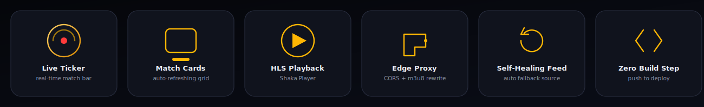

<div align="center">


<br/>


# CRICKCAST LIVE

**A zero-buffer live sports streaming front-end, powered by public sports data and served entirely off the edge.**

[](https://pages.cloudflare.com)
[](https://github.com/shaka-project/shaka-player)
[](#-data-pipeline)
[](#%EF%B8%8F-disclaimer)

<p></p>

[Overview](#-overview) · [Architecture](#%EF%B8%8F-architecture) · [Quick Start](#-quick-start) · [Roadmap](#%EF%B8%8F-roadmap) · [Disclaimer](#%EF%B8%8F-disclaimer)

</div>

<br/>

## ✨ Overview

**CRICKCAST LIVE** turns a public live-sports JSON feed into a polished, self-updating streaming hub — no backend server, no database, no build step. It ships as a static site on **Cloudflare Pages**, with a single **Pages Function** acting as an edge-side CORS/HLS proxy so streams play directly in-browser through **Shaka Player**.

<div align="center">

</div>

<br/>

## 🚀 Features

<div align="center">

</div>

<br/>

| Capability | Detail |
|---|---|
| 🔴 **Live match ticker** | Scrolling bar surfaces every match currently live, at a glance |
| 🃏 **Adaptive match cards** | Auto-refreshing grid with live badges, team pills, and tournament metadata |
| 🎬 **In-browser HLS playback** | Shaka Player, restyled with a custom control theme |
| 🛰️ **Edge CORS proxy** | One Cloudflare Function rewrites `.m3u8` manifests so every segment, key, and sub-playlist plays — not just the master file |
| 🔄 **Self-healing data source** | Falls back automatically to the upstream feed if the primary mirror is ever unreachable |
| 🌗 **Light / dark theme** | Persisted per-visitor, one click to switch |
| 📱 **Fully responsive** | Grid reflows from 3 columns down to 1 on mobile |
| ⚡ **Zero build step** | Plain HTML/CSS/JS — deploy by pushing to `main` |

<br/>

## 🏗️ Architecture

<div align="center">

</div>

**Flow, step by step:**

| Step | What happens |
|:---:|---|
| **1** | The upstream live-events feed is mirrored into this project's own JSON file via a GitHub Actions cron, every 5 minutes |
| **2** | `index.html` fetches that mirrored JSON on load, then again every 60 seconds |
| **3** | Clicking **Watch Live** opens `fc-play.html` with the raw stream URL attached |
| **4** | Shaka Player requests the manifest through `/api/proxy?u=…` instead of hitting the origin directly |
| **5** | `proxy.js` (a Cloudflare Pages Function) fetches the manifest and segments from the origin CDN with the correct headers |
| **6** | Every URI inside the manifest — segments, keys, sub-playlists — is rewritten to also route through the proxy, then handed back to the player |

This last step is the part that's easy to skip and the reason most naive CORS proxies for HLS "load but never play": a proxy that only forwards the master playlist still leaves every segment request going straight to the origin, where it gets blocked.

<br/>

## 🗂️ Project Structure

```text
crickcast/
├── index.html               # Match listing — fetch, render, auto-refresh
├── fc-play.html              # Shaka Player-based video player page
├── README.md
├── assets/                   # README graphics (banner, logo, diagrams)
└── functions/
    └── api/
        └── proxy.js          # Edge CORS proxy + HLS manifest rewriter
```

<br/>

## 🧰 Tech Stack

<div align="center">


</div>

<br/>

## 📡 Data Pipeline

```text
Origin feed  →  GitHub Actions (every 5 min)  →  mirrored JSON  →  index.html (cache-busted fetch)
```

If the primary mirror is ever unreachable, `index.html` transparently falls back to the upstream feed directly — the grid never goes blank because of a single failed request.

<br/>

## ⚡ Quick Start

**Deploy your own copy in under two minutes:**

```bash
# 1. Clone or fork this repo
git clone https://github.com/<your-username>/crickcast.git
cd crickcast

# 2. Push to your own GitHub repo
git remote set-url origin https://github.com/<your-username>/<your-repo>.git
git push -u origin main
```

Then on [Cloudflare Pages](https://pages.cloudflare.com):

1. **Create a project** → connect your GitHub repo.
2. **Build settings** → leave blank (this is a static site, no build command needed).
3. **Deploy** → Cloudflare picks up `functions/api/proxy.js` automatically as an edge Function.

No environment variables, no backend to provision.

<br/>

## 🗺️ Roadmap

- [ ] Match search & category filters (Cricket / Tennis / Football / Motorsport)
- [ ] Picture-in-picture persistent mini-player
- [ ] Push notifications for followed teams going live
- [ ] Dedicated mobile PWA shell

<br/>

## ⚠️ Disclaimer

This project is built **strictly for educational and research purposes** — to explore live-streaming architecture, edge computing, and HLS manifest handling. It re-serves publicly available stream URLs from a third-party feed and does not host, encode, or own any broadcast content. Please respect the terms of service and broadcasting rights of the original content providers, and do not use this project for commercial redistribution.

<br/>

## 📬 Contact

Built by **[Pranav](https://github.com/pranavreddy1721)** — [LinkedIn](https://linkedin.com/in/pranavreddy1721) · [Portfolio](https://portfolio-pranav.pages.dev)

<div align="center">
<sub>Made with ☕ and a stubborn refusal to let a stream buffer.</sub>
</div>
