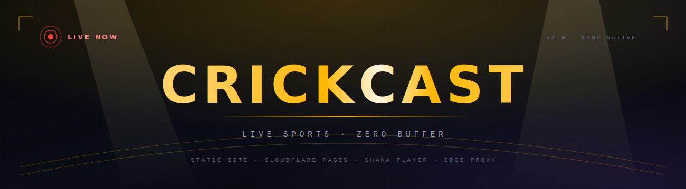
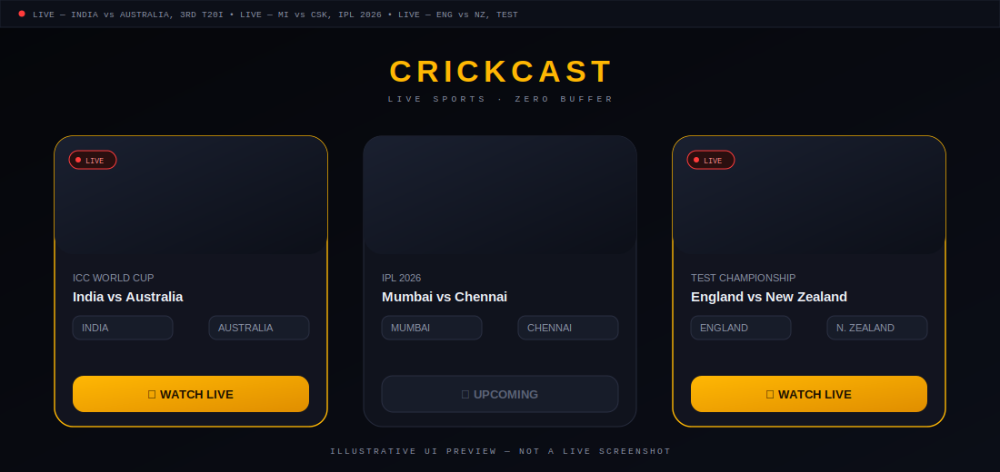
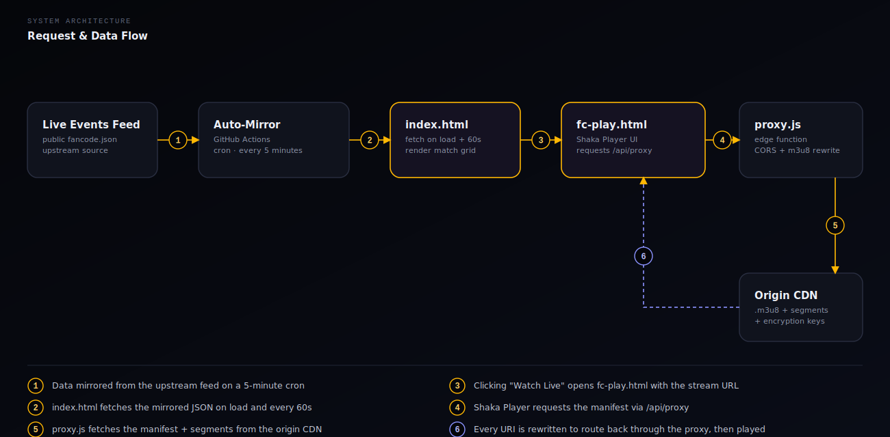

<p align="center">
  
</p>

<p align="center">
  
  
  
  
  
</p>

<p align="center">
  <b>A live sports match hub with a stadium-floodlight interface, a real-time ticker, and buffer-free HLS playback — deployed as a static site with a single edge function.</b>
</p>

<br>

## Contents

- [Overview](#overview)
- [Features](#features)
- [Preview](#preview)
- [Architecture](#architecture)
- [Project structure](#project-structure)
- [Tech stack](#tech-stack)
- [Getting started](#getting-started)
- [Configuration](#configuration)
- [Disclaimer](#disclaimer)
- [Contributing](#contributing)
- [License](#license)

<br>

## Overview

CRICKCAST pulls live match data from a public sports feed, presents it as an interactive grid, and streams the match through a self-hosted proxy so playback stays smooth and CORS-free. There's no backend to run, no database, and no build step — it's three files and one edge function, deployable to Cloudflare Pages in minutes.

<br>

## Features

| | |
|---|---|
| 📡 **Live ticker** | A scrolling scoreboard-style strip surfaces every match currently live, updated on each page load. |
| 🎴 **3D match cards** | Glass cards track the cursor with a spotlight glow and a subtle tilt — built in pure CSS/JS, no libraries. |
| 🔴 **Live-state badges** | Animated radar-ping indicators distinguish *Live*, *Upcoming*, and *No Stream* at a glance. |
| 🎬 **Adaptive HLS playback** | [Shaka Player](https://github.com/shaka-project/shaka-player) handles manifest parsing, quality switching, and a custom control theme. |
| 🌐 **CORS-safe streaming proxy** | A Cloudflare Pages Function fetches and rewrites `.m3u8` manifests so every segment plays through your own domain. |
| 🌓 **Dark / light theme** | Persisted with `localStorage`, respects system preference on first visit. |
| ⚡ **Zero build step** | Static HTML/CSS/JS plus one function file — push to Git, connect to Pages, done. |

<br>

## Preview

<p align="center">
  
</p>

<p align="center"><sub>Illustrative mockup of the live interface — actual match data and images are pulled at runtime.</sub></p>

<br>

## Architecture

<p align="center">
  
</p>

1. **`index.html`** fetches the live-events feed on load and renders each match as a card.
2. Selecting **Watch Live** navigates to `fc-play.html?url=<encoded stream URL>`.
3. **`fc-play.html`** requests that stream through `/api/proxy?u=…` instead of calling the origin directly.
4. **`functions/api/proxy.js`** — a Cloudflare Pages Function — fetches the manifest server-side, rewrites every segment and key URL inside it to route back through the proxy, and returns it with permissive CORS headers.
5. **Shaka Player**, running inside `fc-play.html`, loads the rewritten manifest and plays it with adaptive bitrate switching.

<br>

## Project structure

```
crickcast/
├── index.html                 # Home page — live ticker + match grid
├── fc-play.html                # Player page — Shaka Player + proxy playback
├── functions/
│   └── api/
│       └── proxy.js            # Edge function: CORS proxy + m3u8 rewriting
├── assets/
│   ├── banner.svg               # README hero banner
│   ├── logo-mark.svg            # Compact logo / icon
│   ├── architecture.svg         # Data-flow diagram
│   └── ui-preview.svg           # Interface preview graphic
└── README.md
```

<br>

## Tech stack

<p>
  
  
  
  
  
  
</p>

<br>

## Getting started

### Run locally

No build tooling is required — any static file server works:

```bash
git clone https://github.com/<your-username>/crickcast.git
cd crickcast
npx serve .
```

> The streaming proxy (`functions/api/proxy.js`) only runs on Cloudflare Pages infrastructure. For full local parity, use the Cloudflare Wrangler CLI:
> ```bash
> npx wrangler pages dev .
> ```

### Deploy to Cloudflare Pages

1. Push this repository to GitHub.
2. In the Cloudflare dashboard: **Workers & Pages → Create → Pages → Connect to Git**.
3. Framework preset: **None**. Build command: *(leave empty)*. Build output directory: `/`.
4. Deploy — `functions/api/proxy.js` is auto-detected as a Pages Function, no extra configuration needed.

<br>

## Configuration

| Setting | Location | Notes |
|---|---|---|
| Match data source | `DATA_URL` in `index.html` | Public JSON feed of live events. |
| Player route | `PLAYER_URL` in `index.html` | Defaults to `/fc-play?url=` |
| Proxy endpoint | `PROXY_BASE` in `fc-play.html` | Defaults to `/api/proxy?u=` |
| Join-channel link | `whatsappPopup` block in `fc-play.html` | Update to your own community link. |

If matches stop appearing, check that the configured `DATA_URL` feed is still reachable and returning valid JSON — the UI will show a **"Failed to load matches"** state if the fetch fails.

<br>

## Disclaimer

CRICKCAST is an independent aggregator interface built for personal and educational use. It is **not affiliated with, endorsed by, or sponsored by FanCode** or any broadcaster. All match data and streams are sourced from publicly available feeds; this project does not host, store, or re-encode any media.

<br>

## Contributing

Issues and pull requests are welcome. For larger changes, please open an issue first to discuss what you'd like to change.

<br>

## License

Released under the [MIT License](./LICENSE).

<br>

<p align="center">
  
  <br>
  <sub>Built for cricket fans who hate buffering.</sub>
</p>
