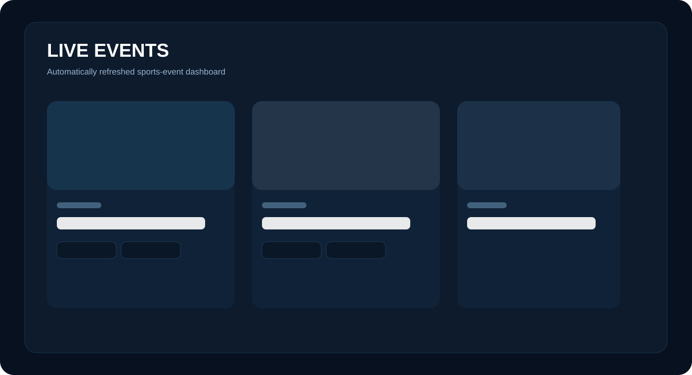
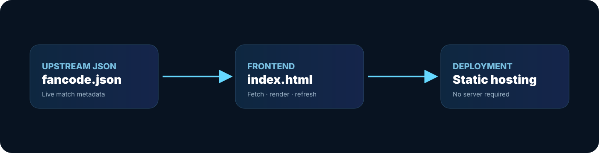

<div align="center">


# Live Events

**A clean, lightweight, automatically refreshed sports-events dashboard built with plain HTML, CSS and JavaScript.**

<p>
  
  
  
  
</p>

[Overview](#-overview) · [Features](#-features) · [Architecture](#-architecture) · [Setup](#-quick-start) · [Customization](#-customization) · [Disclaimer](#-disclaimer)

</div>

## ✨ Overview

Live Events is intentionally simple: there is no framework, database, build process, or application server. The single-page frontend requests the configured JSON feed directly, renders every event in the `matches` array, and refreshes automatically.

<div align="center">

</div>

The current data source is the public `fancode.json` file in [`drmlive/fancode-live-events`](https://github.com/drmlive/fancode-live-events/blob/main/fancode.json). The feed currently exposes fields including category, match ID, title, teams, status, start time and image metadata. citeturn0view0

## 🚀 Features

| Feature | Description |
|---|---|
| 🔄 **Automatic refresh** | Re-fetches the JSON feed every 60 seconds and also provides a manual refresh button. |
| 📡 **Live data** | Reads the latest `matches[]` array instead of maintaining a local copy. |
| 🃏 **Responsive cards** | Simple 3-column desktop layout that collapses cleanly on tablets and phones. |
| 🔴 **Live prioritization** | Live events are placed before upcoming events. |
| 🖼️ **Event imagery** | Uses the image supplied by each feed record with a fallback image. |
| 🧩 **Zero dependencies** | Plain HTML/CSS/JavaScript; no npm install and no build command. |
| ⚡ **Static hosting friendly** | Suitable for GitHub Pages, Cloudflare Pages, Netlify or any static host. |
| 🛡️ **No local feed storage** | The browser reads the configured source at runtime, keeping the repository lightweight. |

## 🏗️ Architecture

<div align="center">

</div>

```text
┌──────────────────────────────┐
│ drmlive/fancode-live-events  │
│        fancode.json          │
└──────────────┬───────────────┘
               │ HTTPS fetch
               ▼
┌──────────────────────────────┐
│          index.html          │
│  fetch → parse → sort → UI   │
└──────────────┬───────────────┘
               │
               ▼
┌──────────────────────────────┐
│       Static web hosting     │
│ GitHub Pages / Cloudflare... │
└──────────────────────────────┘
```

### Refresh behavior

- Initial fetch happens when the page loads.
- A cache-busting query parameter is added to each request.
- The browser requests the latest feed with `cache: "no-store"`.
- The page refreshes the event list every **60 seconds**.
- A manual **Refresh** button is available at any time.

## 📁 Project Structure

```text
fam/
├── index.html              # Complete frontend: UI + data fetching + refresh logic
├── README.md               # Project documentation
├── LICENSE                 # Repository license
└── assets/
    ├── banner.svg          # README hero banner
    ├── architecture.svg    # Architecture diagram
    └── preview.svg         # README UI preview
```

The previous standalone player page and edge proxy are intentionally not included in this simplified version because the project is focused on **displaying the live event feed**, not implementing a separate streaming/proxy layer.

## 🧰 Tech Stack

- **HTML5** — document structure
- **CSS3** — responsive UI and visual design
- **Vanilla JavaScript** — feed retrieval, parsing and rendering
- **GitHub raw content** — runtime JSON source
- **Static hosting** — deployment target

No React, Node.js, npm, bundler, database or server-side API is required.

## ⚡ Quick Start

### 1. Clone the repository

```bash
git clone https://github.com/<your-username>/<your-repository>.git
cd <your-repository>
```

### 2. Open locally

You can serve it with any static HTTP server. For example:

```bash
python -m http.server 8000
```

Then open `http://localhost:8000`.

### 3. Deploy

Upload the repository to your preferred static host. There is **no build command** and no environment configuration required for the default feed URL.

## ⚙️ Customization

The important configuration is at the top of the script in `index.html`:

```js
const DATA_URL = 'https://raw.githubusercontent.com/drmlive/fancode-live-events/main/fancode.json';
const REFRESH_MS = 60_000;
```

To use another compatible JSON feed, replace `DATA_URL`. The frontend expects an object shaped approximately like:

```json
{
  "matches": [
    {
      "event_category": "Cricket",
      "match_id": "example",
      "match_name": "Team A vs Team B",
      "event_name": "Example League",
      "src": "https://example.com/image.jpg",
      "team_1": "Team A",
      "team_2": "Team B",
      "status": "LIVE",
      "startTime": "02:30:00 PM 04-09-2026"
    }
  ]
}
```

You can also change `REFRESH_MS` to control how often the page checks for updates.

## 🖼️ README Visuals

The repository intentionally keeps only three lightweight SVG graphics for documentation:

1. **Banner** — project identity and hero section.
2. **Architecture** — explains the runtime data flow.
3. **Preview** — gives visitors a quick visual understanding of the interface.

They are stored locally so the README remains visually consistent even if an external image host changes.

## 🔒 Data & Responsible Use

This project is a frontend data-display example. It does not host a copy of the upstream JSON feed and does not provide an application server or proxy for third-party media.

The upstream repository is independently maintained. Its current `fancode.json` file is publicly visible on GitHub and contains the event records used by the frontend. citeturn0view0

Use upstream data and associated media only in accordance with the source provider's terms, applicable copyright rules, and any relevant licensing or authorization.

## 🗺️ Roadmap

- [ ] Search events
- [ ] Filter by sport/category
- [ ] Filter Live / Upcoming
- [ ] Event sorting options
- [ ] Optional dark/light theme switch
- [ ] Configurable refresh interval
- [ ] Last-updated timestamp from the feed

## 📄 License

See [`LICENSE`](./LICENSE) for the repository's license terms.

## 🙌 Credits

- Data source: [`drmlive/fancode-live-events`](https://github.com/drmlive/fancode-live-events)
- Frontend: plain HTML, CSS and JavaScript

<div align="center">

**Simple code. Fresh data. No unnecessary infrastructure.**

</div>
